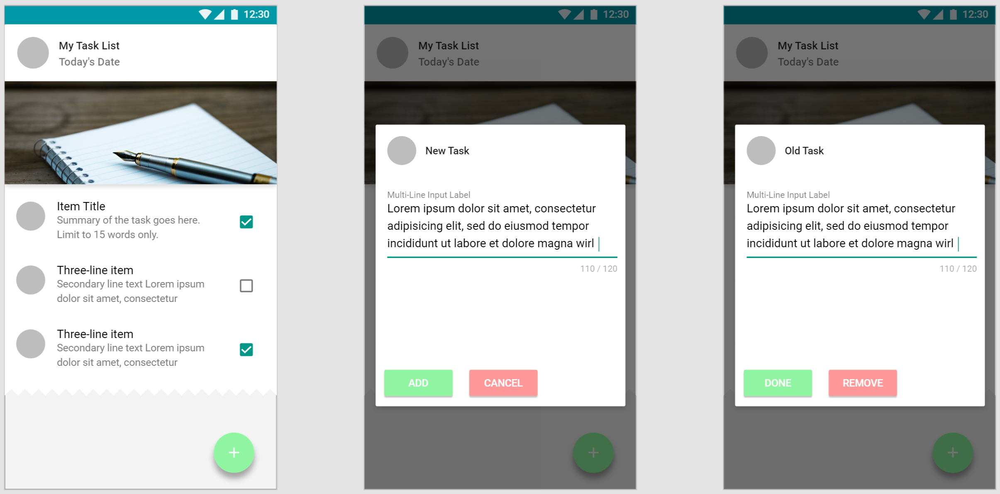

# Assignment 01

**TODO List**

**Due Date: Week 7 - Midnight of 3/8/2017**

## Assignment Specification

Develop a ToDo List that allows users to manage tasks.
* It should allow the user to create, read(diplay), edit and delete tasks.
* Pick and use a standard library for CSS styling. My recommendation is [Materialize CSS](http://materializecss.com/)
* Your designs **must** be [responsive](https://developers.google.com/web/tools/chrome-devtools/device-mode/emulate-mobile-viewports)
* Take care of proper positioning of the UI elements
* **BONUS POINTS** for custom animated elements
* You do not need to save the tasks yet. We'll cover that in class later

## :star2: [Accept Assignment](https://classroom.github.com/assignment-invitations/fa9b8a186aae86d6585e4297354cb863)

## Submission Details
All the submission must be done through github to our [class organization](https://github.com/Web-Advanced-Spring-2017). The assignment will be accomodated and distributed using [GitHub Classroom](https://classroom.github.com/). GitHub classroom will automatically create a repository in our organization for each student and will grant administrative rights of that repository to that student.    
All students **MUST** visit this url: [Confirmation Link](https://classroom.github.com/assignment-invitations/fa9b8a186aae86d6585e4297354cb863). There you will be asked to accept and confirm the reception of the Assignment and consequently a repository will be automatically created for you under our organization. The name of your repository will follow the following pattern: `assignment-01-${your GitHub username}`.

In your own new assignment respository `https://github.com/Web-Advanced-Spring-2017/assignment-01-${your username}`, go on and delete README.md and replace it with the readme of your choice.    

The assignments must be functional upon submission. The code should be well commented and self-explanatory. All references must be properly cited. Document your submission in the `readme.md`

## Resources
* [Google Chrome Responsive Tools](https://developers.google.com/web/tools/chrome-devtools/device-mode/emulate-mobile-viewports)
* [Materialize CSS](http://materializecss.com/)
* [Semantic UI Kit](http://semantic-ui.com)
* [Twitter Bootstrap](http://getbootstrap.com/)
